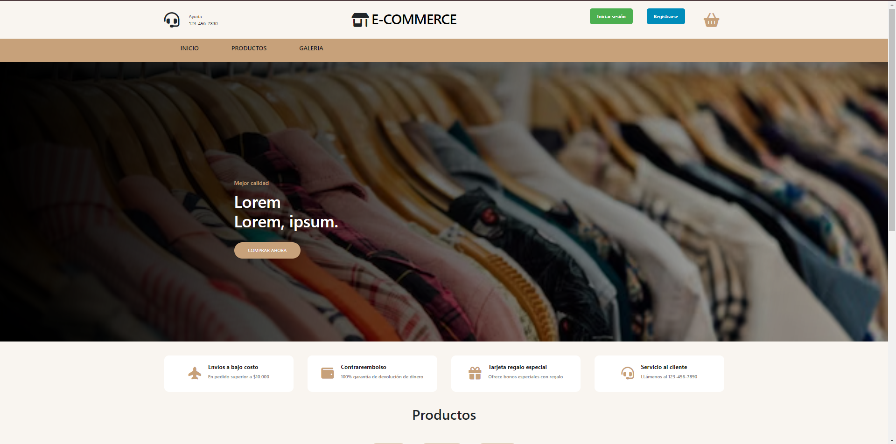

## E-COMMERCE

<h2> Sitema completo de E-COMMERCE que contiene: </h2>

<h3>ADMINISTRACIÓN:</h3>
<ul> 
    <li>Administración de pedidos</li>
    <li>Administración de productos (categoria, precio, stock, etc)</li>
    <li>Roles de usuarios</li>
    <li>Roles de usuarios</li>
</ul>

<h3>USUARIO:</h3>
<ul> 
    <li>Login y Registro</li>
    <li>Mis pedidos</li>
    <li>Carrito de compras</li>
    <li>Realizar compra</li>
</ul>

